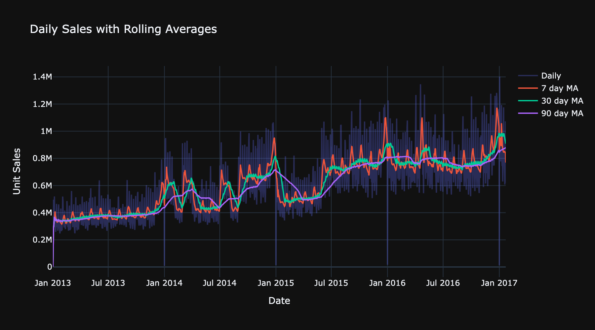
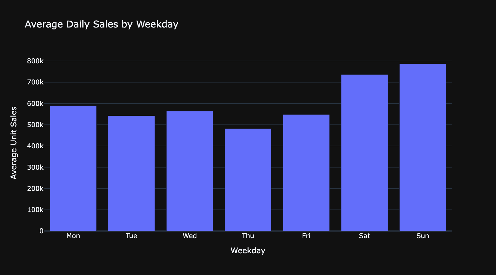
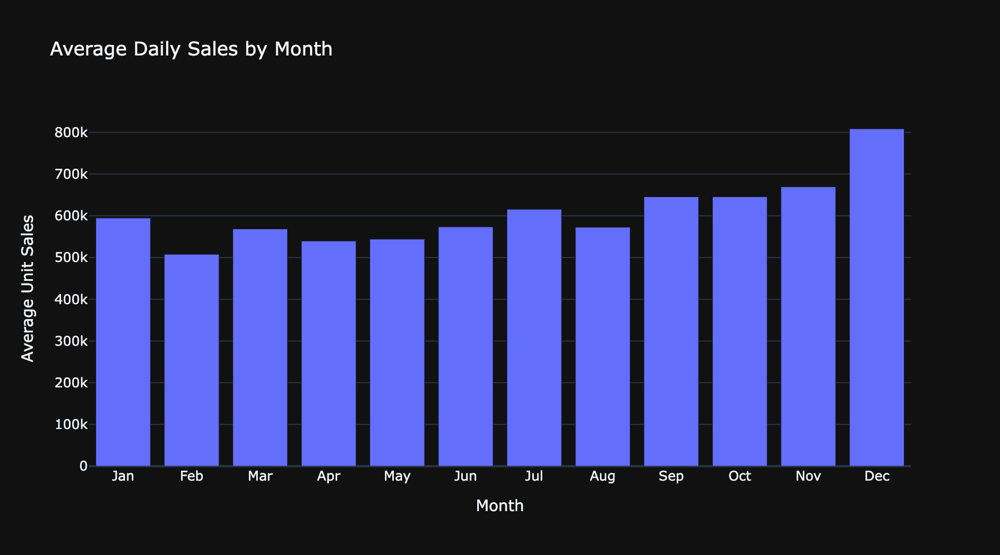
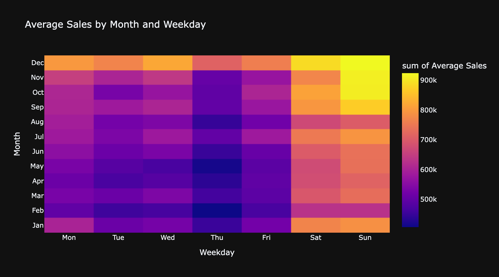
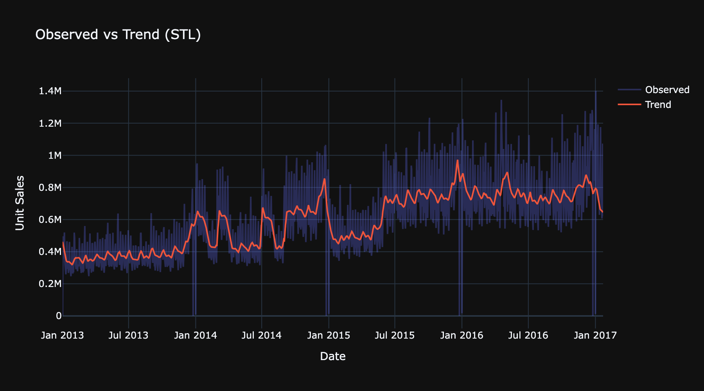
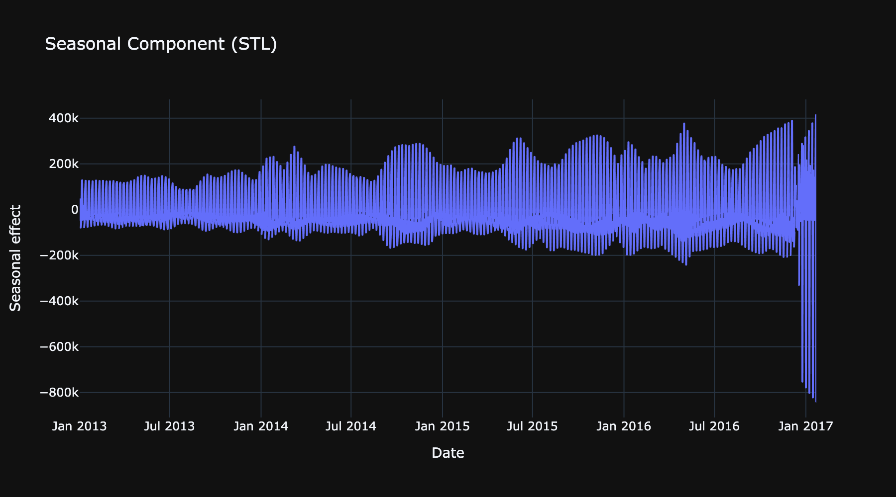
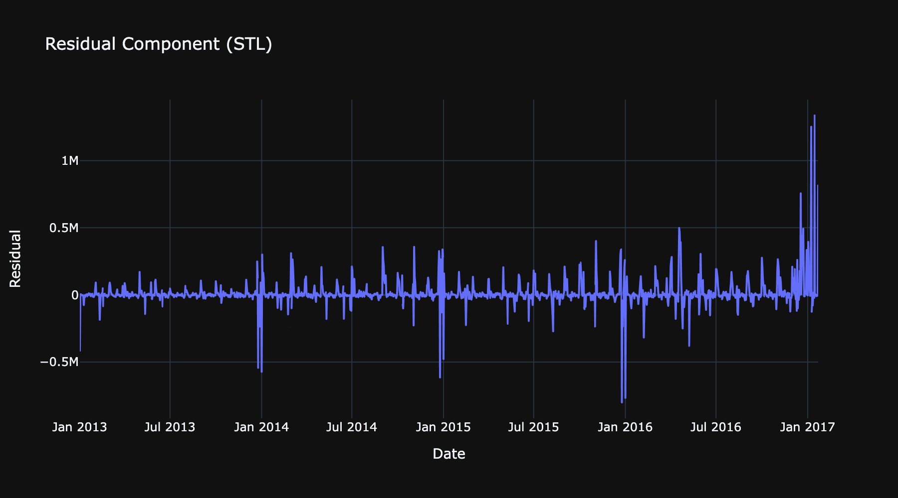

# 📦 Corporación Favorita Grocery Sales Forecasting
A modular, clean, and scalable forecasting pipeline with Streamlit, Plotly, and Parquet preprocessing.

---

# 📚 Table of Contents
1. [Welcome](#-welcome)
2. [Quickstart](#-quickstart)
3. [VS Code Interpreter](#-vs-code-interpreter)
4. [EDA Notebooks](#-eda-notebooks)
5. [Overview EDA](#-1-overview-eda)
6. [Deep Dive EDA](#-2-deep-dive-eda)
7. [Seasonality Analysis](#-3-seasonality-analysis)

---

# 👋 Welcome

This repository contains a fully structured data-science workflow for the **Kaggle Corporación Favorita Sales Forecasting** challenge.

Included:

- ⚡ Efficient CSV → Parquet preprocessing
- 📂 Modular data loading & YAML config-based filtering
- 📊 Two-level Exploratory Data Analysis (Overview + Deep Dive)
- 🎨 Reusable Plotly charts (also usable in a future Streamlit app)
- 📈 Dedicated notebook for Seasonality & STL decomposition
- 🖥️ Future-ready Streamlit forecasting dashboard

All components follow a clean, maintainable architecture designed for reusability.

---

# 🚀 Quickstart

### macOS (zsh / bash)
```bash
python3 -m venv .venv && source .venv/bin/activate && python -m pip install --upgrade pip && pip install -e ".[dev]"
```

### Windows PowerShell
```bash
python -m venv .venv; `
. .\.venv\Scripts\Activate.ps1; `
python -m pip install --upgrade pip; `
pip install -e ".[dev]"
```

### Windows CMD
```bash
python -m venv .venv && .\.venv\Scriptsctivate && python -m pip install --upgrade pip && pip install -e ".[dev]"
```

---

# 🧠 VS Code Interpreter

If VS Code does not automatically select the correct Python interpreter:

```bash
cmd + shift + p
```

Then search for:

```text
Python: Select Interpreter
```


---

# 📊 EDA Notebooks

To run the project with visualization dependencies (and let notebooks save images into `img/reports/...`):

```bash
pip install -e ".[viz,dev]"
```

This enables:

- Automatic saving of EDA plots
- Plotly-based visualizations
- A clean environment for notebooks

---

# 🟦 1. Overview EDA

## 🏪 Store & Item Landscape

| Store distribution | Top stores by average sales |
| ------------------ | --------------------------- |
|  |  |

| Top 30 items | Unit sales distribution |
| ------------ | ----------------------- |
|  |  |

---

## 📈 Sales Patterns & Seasonality

| Total sales over time | Average sales by day of week |
| --------------------- | ---------------------------- |
|  |  |

| Promotions vs. sales |
| -------------------- |
|  |

---

# 🟩 2. Deep Dive EDA

## 🎁 Items

| Top 40 families by total sales |
| ------------------------------ |
|  |

---

## 💵 Oil Prices

| Oil price time series |
| ---------------------- |
|  |

---

## 🎉 Holidays

| Holidays by locale |
| ------------------ |
|  |

---

## 🏙️ Stores

| Stores per city |
| --------------- |
|  |

---

## 🛒 Train Dataset (Sales Deep Dive)

| Daily total sales | Unit sales histogram (sample) |
| ----------------- | ----------------------------- |
|  |  |

| Top 30 items by number of rows | Top 30 stores by number of rows |
| ------------------------------ | -------------------------------- |
|  |  |

---

## 💳 Transactions

| Daily transaction totals |
| ------------------------ |
|  |

---

# 🟧 3. Seasonality Analysis

Understanding weekly, monthly, and long-term patterns in the sales time series.

This analysis includes:

- Daily aggregated sales
- Rolling averages (7, 30, 90 days)
- Weekly seasonality
- Monthly seasonality
- Month × weekday interaction (heatmap)
- STL decomposition (trend, seasonal, residual)

All generated in the dedicated seasonality notebook.

---

## 📆 Daily Sales & Trends

| Rolling averages |
| ---------------- |
|  |

---

## 📅 Weekly & Monthly Patterns

| Weekday pattern | Monthly pattern |
| --------------- | --------------- |
|  |  |

---

## 🔥 Month × Weekday Heatmap

| Month × weekday heatmap |
| ------------------------ |
|  |

---

## 🔍 STL Decomposition

| Observed vs trend | Seasonal component | Residuals |
| ----------------- | ------------------ | --------- |
|  |  |  |

---

All plots are exported into:

```text
img/reports/eda_overview/
img/reports/eda_deepdive/
img/reports/seasonality/
```

These assets support both this README and the future Streamlit dashboard.
