# Corporacion Favorita Sales Forecasting with Streamlit

---

Welcome to my Project


---


# Run it!

# macOS (zsh or bash)
```bash
python3 -m venv .venv && \
source .venv/bin/activate && \
python -m pip install --upgrade pip && \
pip install -e ".[dev]"
```


# Windows PowerShell
```bash
python -m venv .venv; `
. .\.venv\Scripts\Activate.ps1; `
python -m pip install --upgrade pip; `
pip install -e ".[dev]"
```


# Windows CMD
```bash
python -m venv .venv && .\.venv\Scripts\activate && python -m pip install --upgrade pip && pip install -e ".[dev]"
```


# maybe under vs code you need to set the interpreter manuell

 ```bash
# open command palett under vs code
cmd + shift + p
```


# EDA Notebook

 ```bash
# if you want run the intery project with the notebooks and create img and reports use the [viz]
pip install -e ".[viz,dev]"
```

---

# 📊 Exploratory Data Analysis Dashboard

This section summarizes the main visual insights generated in the EDA notebooks.
It is structured into:

- **Overview EDA** – high-level behavior across stores, items, time and promotions
- **Deep Dive EDA** – focused views on holidays, oil, items, stores, train and transactions


---

# 🟦 1. Overview EDA

## 🏪 Store & Item Landscape

| Store distribution | Top stores by average sales |
| ------------------ | --------------------------- |
| 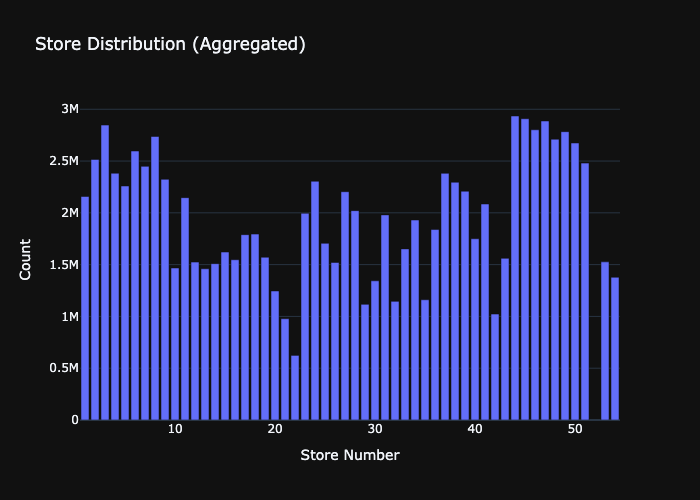 | 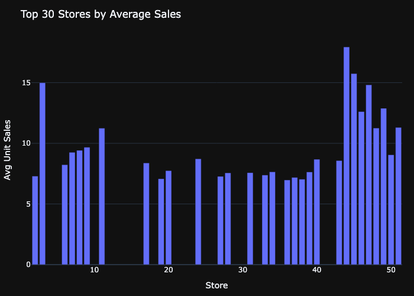 |

| Top 30 items | Unit sales distribution |
| ------------ | ----------------------- |
| 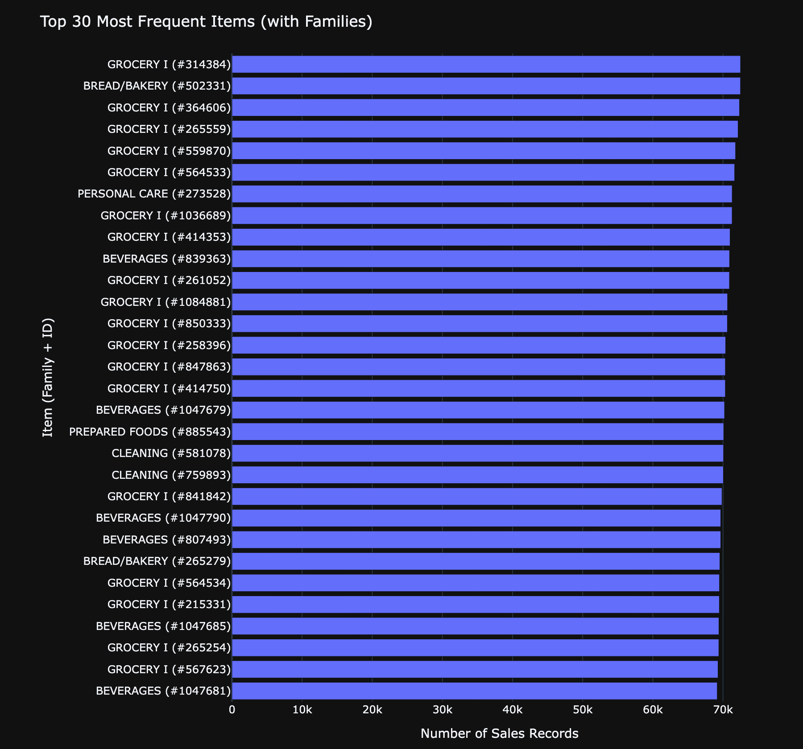 | 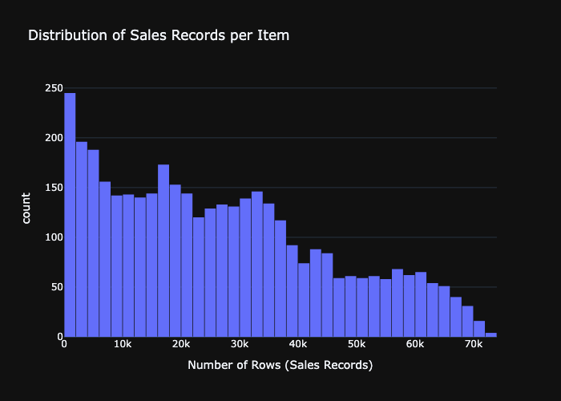 |


## 📈 Sales Patterns & Seasonality

| Total sales over time | Average sales by day of week |
| --------------------- | ---------------------------- |
| 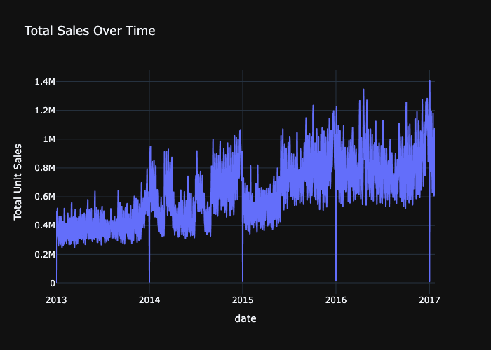 | 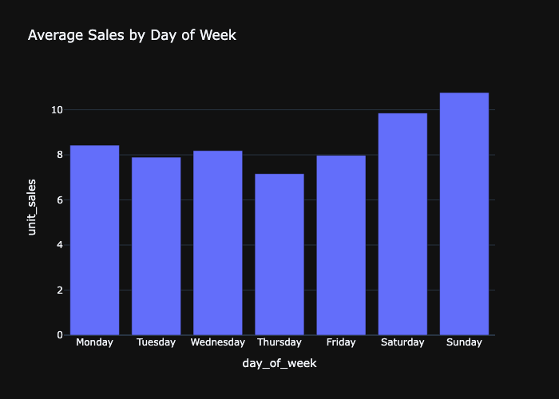 |

| Promotions vs. sales impact |
| --------------------------- |
| 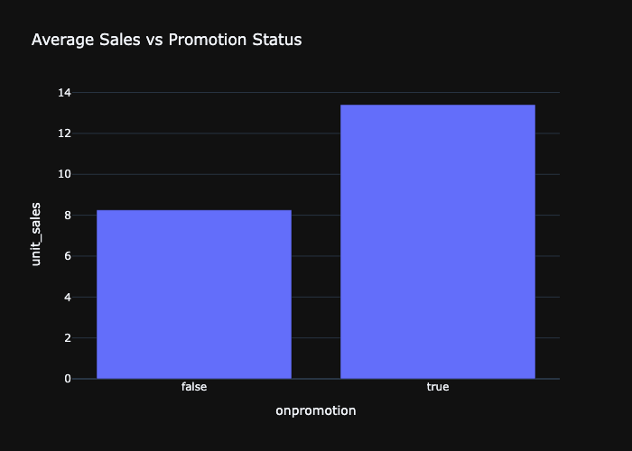 |


---

# 🟩 2. Deep Dive EDA

## 🎁 Items

| Top 40 families by total sales |
| ------------------------------ |
|  |


## 💵 Oil Prices

| Oil price timeseries |
| -------------------- |
| 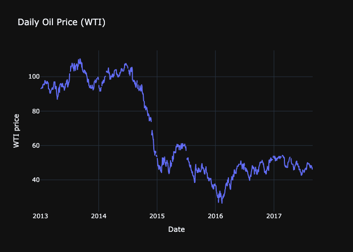 |


## 🎉 Holidays

| Holidays by locale |
| ------------------ |
| 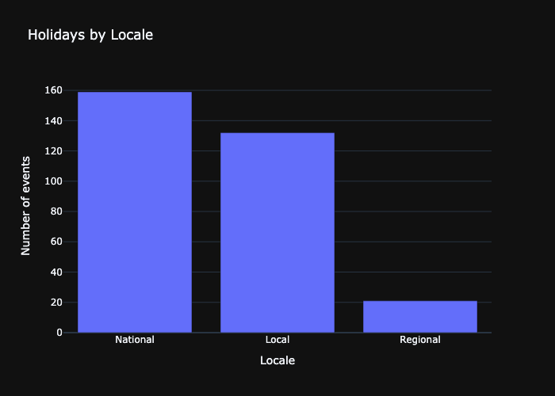 |


## 🏙️ Stores

| Stores per city |
| --------------- |
| 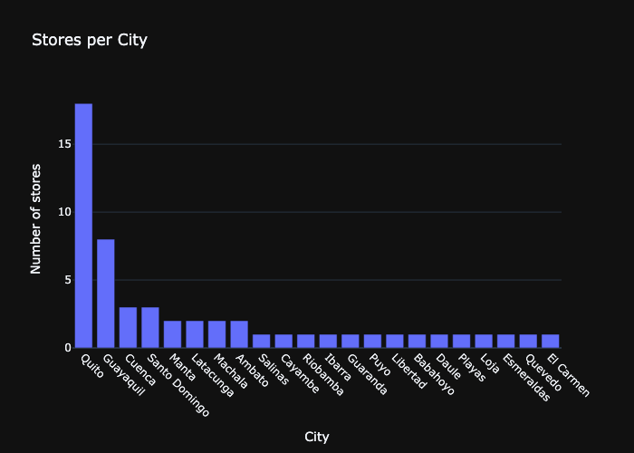 |


## 🛒 Train Dataset (Sales Deep Dive)

| Daily total sales | Unit sales histogram (sample) |
| ----------------- | ----------------------------- |
|  | 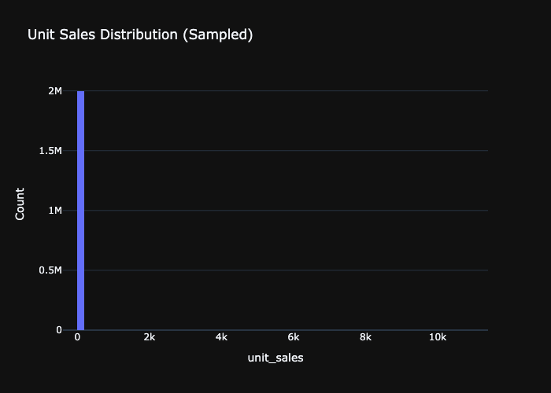 |

| Top 30 items by number of rows | Top 30 stores by number of rows |
| ------------------------------ | -------------------------------- |
| 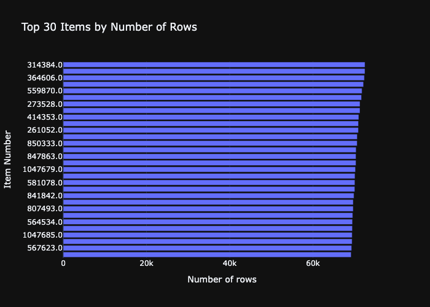 | 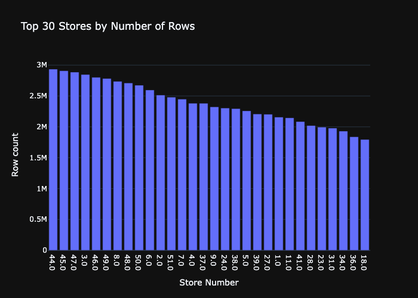 |


## 💳 Transactions

| Daily transaction totals |
| ------------------------ |
|  |


---

All plots shown here are generated by the EDA notebooks and saved under
`img/reports/eda_overview` and `img/reports/eda_deepdive`.